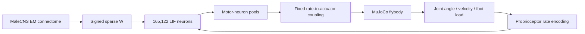
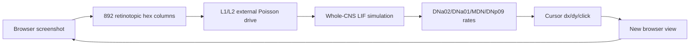

# FLYBRAIN 完整使用教程：从网站阅读到本地复现、数学算法与果蝇神经生理

> 检查日期：2026-09-14  
> 网站：https://flybrain.online/  
> 当前主要代码：https://github.com/fruitflydev/therealfly  
> 历史网页漫游/视觉闭环代码：https://github.com/fruitflydev/flycoinrh  
> 数据：Janelia FlyEM Male CNS v1.0（CC-BY 4.0）

---

## 0. 先说结论：这个网站现在到底是什么

`flybrain.online` 不是一个“上传任务后让果蝇 AI 替你操作电脑”的通用产品，也不是已经完成的数字果蝇。它目前更接近一个**公开、可复核的计算神经科学实验主页**。

截至 2026-09-14，它展示的是两代相关系统：

1. **当前主线：whole-fly / therealfly**  
   将 Janelia 的雄性果蝇完整中枢神经系统连接组（brain + ventral nerve cord, VNC）转换为一个 165,122 神经元的脉冲网络，再尝试直接连接到 `flybody` 的 MuJoCo 果蝇身体。核心原则是：**不用人工设计步态控制器、不训练强化学习策略，只允许固定的神经-肌肉/感觉映射，看测得的连接结构本身能否产生运动。**

2. **上一代：flycoinrh / web roamer**  
   把网页截图映射到果蝇视觉通路，运行同一大规模连接组，再把下降神经元的输出转换为网页光标移动和点击。该版本还包含蘑菇体的简化多巴胺学习规则。

因此，学习这个项目时要把三个层级分开：

- **真实测量层**：电子显微镜连接组、细胞注释、预测递质、部分已知神经元功能；
- **计算模型层**：LIF 神经元、统一突触强度、泊松输入、运动/感觉映射；
- **演示层**：网页光标、MuJoCo 身体、Backrooms 文本叙述等。

“连接是真实测到的”不等于“整个模拟就是真实果蝇生理”。当前作者本人也明确把 `MEASURED`（测量得到）和 `CHOSEN`（人为选择）分开记录。

---

# 1. 在线网站如何使用

## 1.1 首页不是操作台，而是实验状态页

打开：

```text
https://flybrain.online/
```

建议按下面顺序读。

### A. 看最上方的当前实验状态

重点不是动画，而是：

- Male CNS v1.0；
- 165,122 个 traced neurons；
- 10,228,000 个保留下来的 signed synaptic entries；
- 当前 `therealfly` 的 stage 0–3 状态。

### B. 看 four stages

当前项目把“完整脑-身体闭环”拆成四级：

| Stage | 问题 | 2026-09-14 状态 |
|---|---|---|
| 0 | 哪个运动神经元控制哪个腿部肌肉/关节 | 已完成 |
| 1 | 给下降神经元驱动后，VNC 是否自己产生步行节律 | 已运行，FAIL |
| 2 | 运动神经元放电率直接驱动 MuJoCo 关节，身体能否站立/迈步 | 已构建；正式实验未运行，仅 smoke test |
| 3 | 身体关节角与足端载荷反馈为本体感觉输入，形成闭环 | 已构建；正式实验未运行 |

这里的 `FAIL` 很重要：它**不代表“真实果蝇连接组不能走路”**，只代表：

> 在这套统一 LIF 神经元 + 当前递质符号 + 当前突触权重假设 + DNa01/DNa02 150 Hz 驱动 + 当前统计判据下，没有通过预注册的“连接特异性步行节律”检验。

这恰恰是这个项目最值得学习的地方：它保留失败结果，而不是看到结果不好就不断调参直到“能走”。

### C. 看 “what the model is not”

这是判断可信度最重要的区域。当前模型明确承认：

- 所有突触单位强度统一取 0.275 mV；
- 少于 3 个突触的连接丢弃；
- ACh 统一正号，GABA / glutamate / histamine 统一负号；
- dopamine / octopamine / serotonin 等在快速传递矩阵中置零；
- 所有神经元共用同一套 LIF 参数；
- stock 模型无传导延迟、无适应、无突触电流衰减；
- MuJoCo 当前没有真正的肌肉长度-张力、力-速度和神经肌肉接头生理。

所以它是一个**connectome-constrained computational model**，不是逐离子通道的生物物理数字孪生。

---

## 1.2 Backrooms 页面怎么读

打开：

```text
https://flybrain.online/backrooms
```

当前页面用于展示四个独立模拟副本 A/B/C/D 的读数与文本生成。

注意：

- 文字不是“果蝇的想法”；
- 果蝇没有语言；
- 页面将模拟得到的少量神经活动/距离/位移数字作为上下文交给一个小语言模型；
- 文本只是一个受约束的**叙述层**。

所以 Backrooms 可以看作：

```text
神经仿真数值 -> 结构化 readout -> 小语言模型 -> 可读文字
```

不要把最后一步反过来当成神经系统产生语言。

---

# 2. 最推荐的本地使用路线

如果目标是学习算法和复现实验，建议按下面顺序，而不是直接碰历史上的链上功能。

```text
MaleCNS 数据
   ↓
build_graph.py
   ↓
165,122 节点 signed sparse graph
   ↓
FlyBrain LIF 仿真
   ↓
Stage 0 运动神经元映射
   ↓
Stage 1 VNC 节律检验
   ↓
Stage 2 神经 -> MuJoCo 身体
   ↓
Stage 3 身体 -> 本体感觉 -> 神经闭环
```

之后如果要理解早期网页闭环，再运行 `flycoinrh/roam.py`。

---

# 3. 环境与数据准备

## 3.1 硬件建议

最低要求不是由网页决定，而是由 16 万神经元连接图决定。

当前 `therealfly` README 对 Stage 1 的实现会在空闲内存小于约 6 GB 时拒绝启动，并说明一次脑实例约占 2.5 GB。实际建议：

- RAM：至少 16 GB，推荐 32 GB；
- 磁盘：至少预留 5–10 GB；
- CPU：可运行 Stage 0/1；
- NVIDIA GPU：不是 Stage 0/1 的必需条件，但 GPU 版全脑仿真/身体 smoke run 会明显更合适；
- MuJoCo body 环境建议独立 Python 3.12。

## 3.2 克隆两个仓库

为了和当前 `therealfly` 的相对数据依赖方式保持一致，建议放在同一个父目录：

```bash
mkdir flybrain-workspace
cd flybrain-workspace

git clone https://github.com/fruitflydev/flycoinrh.git flybrain
git clone https://github.com/fruitflydev/therealfly.git
```

目录应近似：

```text
flybrain-workspace/
├─ flybrain/      # fruitflydev/flycoinrh
└─ therealfly/    # fruitflydev/therealfly
```

`therealfly` 当前代码中有几个 `FLYBRAIN_ROOT` 仍是开发者机器上的硬编码路径，需要改成你本机的 `flybrain/` 路径。README 指出的主要位置为：

```text
therealfly/data.py
cord/rhythm.py
body/openloop.py
```

后续最好自己把它重构成环境变量，例如：

```python
FLYBRAIN_ROOT = Path(os.environ["FLYBRAIN_ROOT"])
```

这样才便于跨机器复现。

---

# 4. 下载 Male CNS 数据并构建神经图

## 4.1 所需原始文件

MaleCNS v1.0 数据来自 Janelia 公共存储。项目用到的主要文件为：

```text
body-annotations-male-cns-v1.0-minconf-0.5.feather
body-neurotransmitters-male-cns-v1.0.feather
connectome-weights-male-cns-v1.0-minconf-0.5.feather
```

当前公开数据入口：

```text
https://male-cns.janelia.org/download/
```

项目 README 使用的公共 bucket 根目录为：

```text
https://storage.googleapis.com/flyem-male-cns/v1.0/connectome-data/
```

其中连接权重文件约 1.1 GB。

把项目需要的文件放入：

```text
flybrain/data/
```

并按代码所期待的名字整理；尤其要保证：

```text
flybrain/data/body-annotations.feather
flybrain/data/body-neurotransmitters.feather
flybrain/data/connectome-weights.feather
```

对应正确的 MaleCNS v1.0 文件，而不是其他版本。

## 4.2 安装基础依赖

```bash
cd flybrain
python -m pip install -r requirements.txt
```

如果还要运行历史网页漫游：

```bash
python -m playwright install chromium
```

## 4.3 构图

```bash
python build_graph.py
```

正常情况下将产生：

```text
flybrain/build/graph.npz
```

项目当前报告的目标数量为：

```text
165,122 traced non-glia neurons
10,228,000 signed graph entries
```

若数量明显不同，不应直接往下运行；优先检查：

1. 是否下载了 v1.0；
2. minconf 文件是否匹配；
3. Feather 文件是否被重命名错；
4. `MIN_SYN=3` 是否被改变；
5. 是否误把未 traced fragment 或 glia 加进图中。

---

# 5. 运行当前 therealfly 的 Stage 0 / Stage 1

## 5.1 安装

```bash
cd ../therealfly
python -m pip install -r requirements.txt
```

作者测试环境是 Windows 11 + Python 3.14.2；Stage 0/1 本身并不依赖 Windows。

确认 `FLYBRAIN_ROOT` 指向刚才的 `flybrain`。

## 5.2 Stage 0：运动神经元映射

```bash
python -m therealfly.motor_map
```

核心输出：

```text
build/motor_map.json
```

它回答：

```text
连接组中的运动神经元
    ↓
属于哪条腿 T1/T2/T3、左右侧
    ↓
从哪个 nerve 离开
    ↓
已知时，对应哪个 muscle / joint / flexor-extensor pool
```

不要把这里所有映射都看成电子显微镜直接测得。细胞身份、侧别、神经出口可来自 annotation；而“这块肌肉对应模型中的哪个自由度、正负方向是什么”有一部分是人为整理的解剖映射。

## 5.3 Stage 1：测试 VNC 自身能否产生步行节律

```bash
python -m cord.rhythm
```

当前协议：

- 驱动 DNa01 左右各 1 个 + DNa02 左右各 1 个；
- 每个 150 Hz Poisson；
- 先静默 warm-up 0.2 s；
- 再驱动 1.5 s；
- DRIVE / BASELINE / SCRAMBLED；
- 每种条件 6 个随机种子；
- 共 18 次模拟；
- 不使用学习到的 gains。

完成后可重新从保存的 spike 数据分析：

```bash
python -m cord.rhythm --analyze
```

主要结果：

```text
build/cord_spikes.npz
build/cord_rhythm.json
build/cord_rhythm.png
```

## 5.4 单元测试

```bash
python -m pytest -q
```

这一步非常值得保留，因为这个项目的价值很大一部分在于：公式、映射、结果文件和文档尽量互相约束，而不是只有一张漂亮动画。

---

# 6. 配置 MuJoCo 果蝇身体

当前 `flybody` / `dm_control` 依赖更适合 Python 3.12，建议单独环境。

Windows 示例：

```bash
python -m pip install uv
python -m uv venv --python 3.12 .venv312
python -m uv pip install --python .venv312/Scripts/python.exe -r requirements-body-py312.txt

.venv312/Scripts/python.exe -m body.render_once
.venv312/Scripts/python.exe -m pytest -q tests/test_body.py tests/test_mujoco_body.py
```

Linux/macOS 只需把可执行文件路径换成对应 venv 路径。

`render_once` 用于确认：

- MuJoCo 能加载；
- body XML/asset 正常；
- actuator 和 joint inventory 正常；
- 相机渲染可用。

当前项目报告的身体模型包含 68 bodies、103 joints、78 actuators、15 sensors、8 tendons、160 geoms、9 cameras；这属于当前 pinned `flybody` 版本的模型清单，不应推广为真实果蝇固定的“生理数字”。

---

# 7. 为什么当前不应直接把 Stage 2/3 跑出的动画叫“成果”

当前仓库把 Stage 2/3 代码建好了，但由于 Stage 1 未通过，正式 Stage 2 实验没有运行。

已有一个仅用于贯通管线的 smoke trial：身体很快跌倒，也没有形成腿部周期。它不是正式结论，因为没有跑完整 preregistered controls。

因此复现时建议分两种目的：

### 工程调试

你可以运行 body pipeline 检查：

```text
LIF spike -> motor pool rate -> actuator -> body moves
```

### 科学结论

必须保留至少：

```text
DRIVE
NODRIVE
SCRAMBLED
多随机种子
固定的 pass/fail metric
```

否则“看上去动了”并不能证明运动来自连接组特异结构。

---

# 8. 历史网页漫游版本如何运行

如果你的主要兴趣是“让真实 connectome 控制网页/机器人/游戏”，这一部分反而最直观。

## 8.1 安装

```bash
cd flybrain
python -m pip install -r requirements.txt
python -m playwright install chromium
```

确认已经构建：

```text
build/graph.npz
```

复制环境配置：

```bash
cp .env.example .env
```

Windows PowerShell 可直接复制文件后手工编辑。

只启用浏览器实验所需开关，例如：

```text
FLY_ALLOW_BROWSER=1
```

## 8.2 启动纯网页漫游

```bash
python roam.py
```

然后打开：

```text
http://localhost:4660
```

这个 `roam.py` 是更适合科研复现的入口，因为它不需要钱包，也不需要链上交易。

### 安全建议

研究视觉-运动闭环时**不要为了复现神经算法去运行 `rhlive.py`、创建或注资钱包**。那些是另一个链上演示层，不是理解 connectome、LIF、视觉或运动算法所必需。

---

# 9. 整个系统的算法架构

## 9.1 当前脑-身体闭环



关键思想：**没有一个 MPC/PID/RL 网络在中间告诉腿应该怎么走。**

## 9.2 历史网页视觉闭环



---

# 10. 数学原理（一）：如何从连接组得到稀疏权重矩阵

令：

- \(n_{ij}\)：presynaptic neuron \(j\) 到 postsynaptic neuron \(i\) 的突触数量；
- \(s_j\in\{-1,0,+1\}\)：由突触前神经元预测递质得到的符号；
- \(a=0.275\ \mathrm{mV}\)：每个突触的统一电位跳变量。

代码等价于：

$$
W_{ij}=\begin{cases}
a\,s_j n_{ij}, & n_{ij}\ge 3\\
0, & n_{ij}<3
\end{cases}
$$

当前符号表近似为：

$$
s_j=\begin{cases}
+1,&\text{acetylcholine}\\
-1,&\text{GABA, glutamate, histamine}\\
0,&\text{dopamine, octopamine, serotonin, unclear, unknown}
\end{cases}
$$

这里一定要理解：

> 电子显微镜能比较可靠地告诉你“谁和谁连、约有多少突触”，但不能仅靠结构直接测出每个突触的真实电导、受体组成、短时程可塑性和状态依赖增益。

所以 `0.275 mV × synapse count` 是把解剖结构转换成动力学模型所必须做的一层假设。

---

# 11. 数学原理（二）：LIF 神经元

## 11.1 连续形式

最基本的 leaky integrate-and-fire 可以写为：

$$
\tau_m\frac{dV_i}{dt}=-(V_i-V_{rest})+R_m I_i(t)
$$

当前项目统一使用：

```text
Vrest   = -52 mV
Vth     = -45 mV
Vreset  = -52 mV
tau_m   = 20 ms
refrac  = 2.2 ms
dt      = 0.2 ms
```

## 11.2 代码中的精确指数泄漏

在没有输入的一小步内：

$$
V_i^{k+1,-}=V_{rest}+(V_i^k-V_{rest})e^{-\Delta t/\tau_m}
$$

其中：

$$
e^{-0.2/20}\approx 0.99005
$$

所以每 0.2 ms 向静息电位回落约 0.995%。

## 11.3 spike 与瞬时突触跳变

若某一步发放集合为：

$$
\mathcal F_k=\{j:V_j\ge V_{th}\}
$$

则对 postsynaptic neuron：

$$
V_i \leftarrow V_i+\sum_{j\in\mathcal F_k}W_{ij}
$$

之后 presynaptic spike neuron reset：

$$
V_j\leftarrow V_{reset}
$$

并进入 2.2 ms refractory。

因此理论最高 spike rate 约为：

$$
f_{max}\approx\frac{1000}{2.2}=454.5\ \mathrm{Hz}
$$

这就是身体 coupling 中用约 450 Hz 做归一化尺度的来源。

## 11.4 这不是 conductance-based neuron

当前 stock 模型没有显式：

- \(I_{Na}\)、\(I_K\)、\(I_{Ca}\)；
- AMPA/GABA 等受体动力学；
- 突触时间常数；
- 轴突传导延迟；
- spike-frequency adaptation；
- 神经调质状态。

所以它的意义是：**在非常简单、透明的神经动力学下测试 connectome 是否已经足以产生正确的群体传播模式。**

---

# 12. 数学原理（三）：外部泊松驱动

若一个输入神经元外部 rate 为 \(r_i\) Hz，时间步为 
\(Δt\) ms，代码使用每步 Bernoulli 近似：

$$
p_i=\mathrm{clip}\left(r_i\frac{\Delta t}{1000},0,1\right)
$$

随机数小于 \(p_i\) 时，该神经元被推到阈值以上，从而在该步发 spike。

例如：

$$
r=150\ \mathrm{Hz},\quad \Delta t=0.2\ \mathrm{ms}
$$

则：

$$
p=150\times\frac{0.2}{1000}=0.03
$$

也就是每一个 0.2 ms 步有约 3% 的外部触发概率。

对足够小的 Δt，这就是齐次 Poisson 过程的常用离散近似。

---

# 13. 数学原理（四）：Stage 1 如何判断“真的有步行节律”

只看 spike raster 有周期纹理是不够的，因为大规模兴奋网络很容易产生非生理振荡。

## 13.1 M1：运动神经元总体节律

把 381 个腿部运动神经元的 spikes 按 2 ms bin 汇总成：

$$
x_0,x_1,\ldots,x_{N-1}
$$

去均值后求自相关：

$$
R_{xx}(\ell)=\sum_k(x_k-\bar x)(x_{k+\ell}-\bar x)
$$

只在 5–15 Hz 对应的滞后窗口找局部峰：

$$
T=\frac1f\in[66.7,200]\ \mathrm{ms}
$$

即约 68–200 ms 的 lag。

然后把 bin 顺序随机打乱 200 次，得到 surrogate 分布。真实峰必须高于 surrogate 的 95% 阈值。

这个检验回答：

> 周期性是否明显高于同一 spike-count 分布随机排列后会产生的假峰？

## 13.2 M2：左右腿是否反相

若一个 segment 的左右侧信号为 \(L(t),R(t)\)，求 cross-correlation：

$$
R_{LR}(\ell)=\sum_k(L_k-\bar L)(R_{k+\ell}-\bar R)
$$

将峰值 lag 转成相位：

$$
\phi=360^\circ\frac{\ell}{T}
$$

预注册接受窗口为：

$$
120^\circ\le\phi\le240^\circ
$$

也就是大致要求左右交替，而不是完全同步。

## 13.3 M4：SCRAMBLED 控制为什么最关键

SCRAMBLED 并非简单随机生成一张新图，而是在尽量保留：

- 每个突触前单元的输出度；
- 权重值；
- VNC 目标总体入度；

的同时打乱**具体是谁连到谁**。

如果真实网络和 scrambled 网络都同样产生强节律，那么很可能只是：

```text
大网络 + 高兴奋性 + 统一 LIF
```

自然产生的振荡，而不是果蝇解剖 wiring 的特异作用。

当前项目正是因为真实图出现约 45.5 Hz 的同步振荡，而 scrambled 也能产生相关现象，所以不能把它认作“连接组内生步行节律”。

---

# 14. 数学原理（五）：神经放电如何变成 MuJoCo 关节控制

对一个关节的拮抗神经元池，记：

- \(r_+\)：正方向肌群平均 firing rate；
- \(r_-\)：反方向肌群平均 firing rate；
- \(K=1\)：当前全局增益。

先得到归一化控制：

$$
u^*=\mathrm{clip}\left(K\frac{r_+-r_-}{450},-1,1\right)
$$

然后用 20 ms 一阶低通模拟肌肉/执行机构响应惯性：

$$
u_{k+1}=u_k+\left(1-e^{-\Delta t/\tau}\right)(u^*-u_k)
$$

其中：

$$
\tau=20\ \mathrm{ms}
$$

最后围绕 actuator 的 rest control 映射到合法范围 \([c_{min},c_{max}]\)：

$$
c=\begin{cases}
c_0+u(c_{max}-c_0),&u\ge0\\
c_0+u(c_0-c_{min}),&u<0
\end{cases}
$$

这样在 \(u=0\) 时保持模型定义的静息姿态，而不是机械地取 actuator 上下界中点。

### 生理上它缺了什么

真实肌肉至少还会有：

- motor unit recruitment；
- fast / slow motor neuron 差异；
- excitation-contraction coupling；
- activation dynamics；
- length-tension curve；
- force-velocity curve；
- tendon elasticity；
- neuromuscular junction transmission；
- history dependence。

所以这个 coupling 是一个**刻意简单的接口函数**，不是肌肉生理模型。

---

# 15. 数学原理（六）：身体如何反馈成本体感觉神经元

当前 `proprioception.py` 把有限几个能从 annotation 比较可靠映射的感觉群体接回神经系统。

## 15.1 位置编码

对于关节角 \(q\in[q_{min},q_{max}]\)：

$$
r_{pos}=20+180\cdot\mathrm{clip}\left(\frac{q-q_{min}}{q_{max}-q_{min}},0,1\right)
$$

单位 Hz。

因此从关节低端到高端，rate 约 20–200 Hz。

## 15.2 速度编码

$$
r_{vel}=200\cdot\mathrm{clip}\left(\frac{|\dot q|}{20\ \mathrm{rad/s}},0,1\right)
$$

当前没有把所有 hook 的 flexion/extension 方向身份都分开，因为 annotation 中并没有足够信息。

## 15.3 足端载荷/应变编码

近似：

$$
r_{load}=200\cdot\mathrm{clip}\left(\frac{F_{contact}}{W_{fly}},0,1\right)
$$

这里用足端 contact force 作为 campaniform sensilla 所感知 cuticle strain/load 的代理。

---

# 16. 果蝇本体感觉的真实生理基础

这一部分是理解 Stage 3 是否合理的关键。

## 16.1 FeCO（femoral chordotonal organ）

果蝇股节内的 femoral chordotonal organ 是重要的腿部本体感觉器官。Mamiya、Gurung、Tuthill 2018 的实验表明不同亚群编码不同运动学变量：

- **claw**：主要编码 femur–tibia joint position；
- **hook**：对运动方向敏感；
- **club**：对双向运动和振动敏感，而且存在振动频率调谐。

因此项目中：

```text
claw -> joint angle
hook / club -> joint angular speed
```

有明确实验生理基础；但把所有未标方向的 hook/club 简化成 
\(|\dot q|\) 仍然是模型选择。

## 16.2 Hair plates

关节附近的 hair plate 通过机械偏转提供关节姿态/极限位置相关信息。项目把可识别 hair plate 群体简化映射到 thorax-coxa swing angle。

## 16.3 Campaniform sensilla

Campaniform sensilla 对外骨骼形变敏感，可反映载荷和力。项目没有重建具体每个 sensillum 的机械应力场，而是把足端接触载荷作为代理输入。

这是一种从“真实感觉模态”到“简化传感变量”的合理工程近似，但不能说已经重建了完整感觉器官生物力学。

---

# 17. 历史网页视觉系统的数学原理

`flyeye.py` 的思路不是把整张图片喂给 CNN，而是显式利用 MaleCNS annotation 中的 optic-lobe hex coordinates。

## 17.1 六边形视觉柱坐标

设 annotation 给出的轴坐标为 \((h_1,h_2)\)，转换为平面坐标：

$$
x=h_1+\frac12h_2
$$

$$
y=\frac{\sqrt3}{2}h_2
$$

再归一化到 \([0,1]\times[0,1]\)，从光标周围一个局部窗口采样灰度。

## 17.2 项目中的 L1/L2 驱动

代码使用：

$$
r_{L1}=180\,L
$$

$$
r_{L2}=0.6\times180(1-L)
$$

其中 \(L\in[0,1]\) 是采样亮度。

这可以理解为一个人为构造的亮/暗双通道输入。

### 重要生理修正

不要把这写成“真实果蝇 L1 就是纯 ON，L2 就是纯 OFF”。较新的视觉生理研究显示 L1、L2、L3 都携带不同组合的 luminance 与 contrast 信息，并把信息分布到 ON 和 OFF 通路；ON/OFF 的严格选择性是在更下游形成的。

所以 `flyeye.py` 的 L1/L2 映射是**受视觉解剖启发的输入接口**，不是完整视网膜-层板生理模型。

---

# 18. 历史网页版本的运动输出数学原理

`FlyPilot` 读取几个下降神经元群体。

## 18.1 转向

$$
turn=\frac{r_{DNa02,R}-r_{DNa02,L}}{450}
$$

然后：

$$
\Delta x=90\cdot\mathrm{clip}(turn,-1,1)
$$

DNa02 左右差决定转向这一思路有较强实验支持：2025 年 eLife 研究显示 DNa02 是 high-gain steering neuron，转向角速度与左右 DNa02 activity difference 近似线性相关。

## 18.2 前进/后退/停止

代码中：

$$
fwd=\frac{r_{DNa01,L}+r_{DNa01,R}}{2\cdot450}
$$

$$
back=\frac{r_{MDN}}{450}
$$

$$
stop=\frac{r_{DNp09}}{450}
$$

$$
speed=\mathrm{clip}(fwd-back,-1,1)\left(1-\mathrm{clip}(stop,0,1)\right)
$$

$$
\Delta y=-90\,speed
$$

### DNa01 的生理学 caveat

历史项目把 DNa01 当作 cursor-y / forward readout，但较新的单细胞电生理结果更支持：

- DNa01：low-gain steering；
- DNa02：high-gain steering。

双侧激活确实能影响整体 walking，但把 DNa01 直接等同于“前进油门”过于简化。

因此当前 `therealfly` README 已明确把双侧 DNa01+DNa02 150 Hz 称为 **CHOSEN drive**，而不是测量得到的自然 walking command。

---

# 19. 蘑菇体学习算法与生理基础

历史 `flycoinrh/mushroom.py` 是项目中少数真正允许权重改变的地方。

## 19.1 生物回路

果蝇蘑菇体（mushroom body, MB）中：

```text
odor / sparse representation
        ↓
Kenyon cells (KC)
        ↓
KC -> MBON synapses
        ↓
MB output neurons (MBON)
```

不同 dopamine neurons（DAN）投射到不同 mushroom-body compartments。PAM 与 PPL1 等群体携带不同强化相关信号。

经典实验表明：当一个 KC 表征与特定 dopamine signal 在合适时间关系下配对时，可导致对应 compartment 的 **KC->MBON synaptic depression**。

因此这个项目没有用“普通神经网络反向传播”，而是做局部 eligibility + dopamine-gated depression。

## 19.2 eligibility trace

若一个 KC 最近发过 spike，把对应 synapse eligibility 记为 1；每次观察后衰减：

$$
e_{t+1}=\lambda e_t
$$

默认：

$$
\lambda=0.55
$$

最近活动过的 KC->MBON synapse 才能被后到的 dopamine 事件修改。这使学习具备时间关联性。

## 19.3 多巴胺门控突触抑制

当前代码近似：

$$
g\leftarrow g\left(1-\eta a e\right)
$$

其中：

- \(g\)：该 KC->MBON connection 的 gain；
- \(η=0.06\)：选定学习率；
- \(a\in[0,1]\)：dopamine event amount；
- \(e\)：eligibility；
- gain floor 默认 0.25。

于是：

$$
g\ge0.25
$$

这里只有 depression，没有项目自定义的对称 potentiation。

## 19.4 遗忘

设记忆 half-life 为 \(T_{1/2}=6\) h，经过真实墙钟时间 \(Δt\) 后：

$$
k=2^{-\Delta t/T_{1/2}}
$$

$$
g\leftarrow1-(1-g)k
$$

也就是 gain 随时间重新回到 baseline 1。

### 哪些是生理事实，哪些是建模选择

较有实验依据：

- KC->MBON 是重要学习可塑性位点；
- dopamine 对 compartment 特异；
- paired activity 可诱发 KC->MBON depression。

人为选择：

- 学习率 0.06；
- floor 0.25；
- eligibility decay 0.55；
- 6 h 遗忘半衰期；
- 网页“新奇/收益”等抽象事件何时被当成 reward/punishment。

尤其最后一点绝不能说成“果蝇觉得网页有奖励”。真实果蝇并没有理解网页目标。

---

# 20. 为什么真实 connectome 仍不能直接等于完整功能模型

这是整个项目最重要的理论问题。

电子显微镜连接组主要提供结构：

$$
\text{Topology}+\text{synapse count}+\text{morphology}+\text{annotations}
$$

而动力学行为还依赖：

$$
\begin{aligned}
&\text{synaptic conductance}\\
&+\text{receptor type}\\
&+\text{delay}\\
&+\text{short-term plasticity}\\
&+\text{intrinsic ion channels}\\
&+\text{neuromodulation}\\
&+\text{state/arousal}\\
&+\text{sensory transduction}\\
&+\text{muscle/body mechanics}
\end{aligned}
$$

所以更准确的关系是：

$$
\boxed{\text{Behavior}=F(\text{connectome},\text{neural dynamics},\text{sensory state},\text{body},\text{environment})}
$$

而不是：

$$
\text{Behavior}=F(\text{connectome only})
$$

2026 年完整 brain-and-cord connectome 研究本身也强调：果蝇控制架构包含局部 sensory-effector feedback loops，并由 ascending/descending long-range circuits 组织。也就是说，**身体和反馈不是连接组之外的附件，而是神经控制结构的一部分。**

---

# 21. 当前 Stage 1 失败应该怎样科学解释

当前结果最不应写成：

> “数字果蝇失败，所以连接组没有运动程序。”

正确表述应是：

> “在当前统一 LIF、统一每突触 0.275 mV、简化递质符号、无完整延迟/突触动力学、双侧 DNa01/DNa02 150 Hz 泊松驱动等假设下，预注册统计协议没有发现可归因于原始 wiring 特异性的 5–15 Hz 腿部运动神经节律。”

因为改变任意一个下列项都可能改变稳定性和振荡频率：

- E/I 权重比例；
- synaptic decay；
- conduction delay；
- membrane heterogeneity；
- intrinsic adaptation；
- electrical synapses；
- neuromodulators；
- sensory feedback；
- descending command identity/rate；
- motor-neuron recruitment。

因此当前失败更像是在告诉研究者：

> **解剖连接结构 + 极简统一动力学并不足以自动恢复自然步行。**

这本身是有信息量的结果。

---

# 22. 如果要把这个项目做得更“生理真实”，推荐的升级顺序

不要直接堆一个大 Transformer 或 RL controller；那会掩盖 connectome 本身到底贡献了什么。

推荐逐层增加生理约束，并且每次只改一个预注册因素。

## Level A：突触动力学

把瞬时 jump 改为：

$$
\tau_s\dot I_s=-I_s+\sum_k w\delta(t-t_k-d)
$$

加入：

- synaptic decay；
- measured/estimated axonal delay；
- receptor-specific time constants。

## Level B：神经元异质性

至少按 cell class 设置：

$$
\tau_m,V_{rest},V_{th},refractory
$$

而不是 165,122 个神经元完全相同。

## Level C：短时程可塑性

例如 Tsodyks–Markram 类：

$$
\dot R=\frac{1-R}{\tau_{rec}}-uR\sum_k\delta(t-t_k)
$$

让高频驱动不再无限线性叠加。

## Level D：神经调质

把 dopamine / octopamine / serotonin 从“权重 = 0”升级为慢变量：

$$
w_{ij}^{eff}=w_{ij}\,M_{ij}(m(t))
$$

其中 \(m(t)\) 是调制状态。

## Level E：肌肉与神经肌肉接头

建议至少加入：

```text
motor spike/rate
 -> muscle activation dynamics
 -> force-length
 -> force-velocity
 -> tendon/joint torque
```

## Level F：更完整本体感觉

加入：

- FeCO direction-selective subclasses；
- vibration channel；
- coxal hair plate 多自由度；
- campaniform field-specific load；
- tactile bristles。

每次升级后都保留：

```text
真实 wiring
scrambled wiring
no-drive
matched-rate controls
```

否则很容易把更复杂模型天然产生的振荡误当成 connectome 机制。

---

# 23. 与传统 AI / 控制算法有什么根本不同

## 23.1 它不是普通人工神经网络

普通深度网络常见形式：

$$
y=f(W_L\cdots f(W_2f(W_1x)))
$$

权重通过数据训练得到。

FLYBRAIN 的核心连接矩阵则主要来自：

$$
W\leftarrow\text{EM connectome}
$$

即先有生物连接，再运行模型。

## 23.2 它不是经典控制器

经典机器人通常：

```text
target trajectory
 -> controller (PID/MPC/RL)
 -> actuator
 -> body
```

therealfly 希望测试的是：

```text
sensory neurons
 -> measured CNS wiring
 -> motor neurons
 -> minimal coupling
 -> body
 -> sensory neurons
```

也就是说，控制规律应主要存在于神经网络结构与动力学内，而不是由外部算法重新写一个步态。

## 23.3 但它仍然包含人为接口

“没有 controller”不等于“没有人为数学”。

至少还有：

- spike rate -> torque 的比例；
- 20 ms low-pass；
- joint sign；
- proprioceptor rate mapping；
- drive choice；
- pass/fail metric。

这些接口必须透明记录，这也是 `therealfly` 把 MEASURED / CHOSEN 分开的原因。

---

# 24. 建议的学习/复现顺序

如果第一次接触这个项目，按下面顺序最不容易乱。

### 第 1 天：只看结构

阅读：

```text
build_graph.py
flysim.py
```

搞懂：

```text
MaleCNS -> W -> LIF
```

### 第 2 天：跑 Stage 0/1

```bash
python -m therealfly.motor_map
python -m cord.rhythm --analyze
```

先分析已经提交的 spike 数据，再决定是否耗时重跑全脑。

### 第 3 天：读身体接口

阅读：

```text
body/coupling.py
body/proprioception.py
body/mujoco_body.py
```

画出：

```text
motor MN -> joint
joint/contact -> sensory neuron
```

### 第 4 天：运行历史视觉闭环

阅读：

```text
flyeye.py
roam.py
```

运行：

```bash
python roam.py
```

### 第 5 天：学习蘑菇体

阅读：

```text
mushroom.py
mb_sides.py
```

重点不是网页奖励，而是：

```text
KC eligibility + compartmental dopamine -> KC-MBON depression
```

---

# 25. 代码阅读地图

## `flycoinrh`

| 文件 | 作用 |
|---|---|
| `build_graph.py` | MaleCNS 表 -> signed sparse graph |
| `flysim.py` | CPU LIF simulator |
| `flysim_gpu.py` | GPU 版本 |
| `flyeye.py` | 视觉采样 + descending-neuron readout |
| `roam.py` | 浏览器闭环 |
| `mushroom.py` | KC->MBON dopamine-gated learning |
| `mb_sides.py` | 依据 PAM/PPL1 输入划分 MBON compartments |
| `olfaction.py` | 嗅觉输入实验 |
| `plume*.py` | 气味 plume 相关实验 |

## `therealfly`

| 文件 | 作用 |
|---|---|
| `therealfly/motor_map.py` | 运动神经元 -> 肌肉/关节映射 |
| `cord/rhythm.py` | Stage 1 节律实验与统计 |
| `body/coupling.py` | motor firing -> actuator |
| `body/proprioception.py` | body state -> sensory Poisson rates |
| `body/mujoco_body.py` | MuJoCo body adapter |
| `body/openloop.py` | Stage 2 runner/scorer |
| `body/render.py` | 视频/渲染 |
| `docs/day2.md` | 第二轮预注册 cord protocol |

---

# 26. 常见误解

### 误解 1：“165,122 个真实神经元都被一比一生物物理复现了”

错误。**连接身份接近一一映射，神经元动力学不是。**所有细胞当前共享统一 LIF。

### 误解 2：“10,228,000 就是真实全部突触总数”

要谨慎。这里是项目构图后保留的 graph entries/连接项；底层 EM 数据可包含更大量的单个 synapse records。项目又丢掉了少于 3 个 synapse 的 neuron-pair，并把调质/未知递质快速权重置零。

### 误解 3：“网页里的文字是果蝇在说话”

错误。语言模型是叙述器。

### 误解 4：“DNa01 就是前进神经元”

过度简化。较新的实验证据把 DNa01/DNa02 都放在 steering control 中，只是 gain 不同。

### 误解 5：“只要身体动起来就证明 connectome 会走路”

错误。必须和 no-drive、scrambled wiring 等控制比较。

### 误解 6：“网站现在仍主要是网页光标直播”

已过时。2026-09-13 之后首页重点已经转到 MaleCNS + MuJoCo 身体闭环实验；网页漫游属于前一阶段代码。

---

# 27. 最值得借鉴的研究方法

这个项目最值得移植到其他仿生/具身智能研究的，不只是“果蝇脑”本身，而是下面这套实验逻辑：

1. **先固定结构来源**：哪些数据是真实测量的；
2. **把每个人为假设写出来**：参数、映射、阈值；
3. **先跑便宜的 falsification test**；
4. **提前写 pass/fail rule**；
5. **一定跑 topology-destroying control**；
6. **失败也保留**；
7. **只有前一级通过，才增加身体/闭环复杂度**；
8. **视觉演示与科学结论分开**。

这比“先做一个看起来会走的动画，然后解释为什么像生物”科学得多。

---

# 28. 参考资料

## 项目与数据

1. FLYBRAIN: https://flybrain.online/
2. therealfly: https://github.com/fruitflydev/therealfly
3. flycoinrh: https://github.com/fruitflydev/flycoinrh
4. Male CNS Connectome Project: https://male-cns.janelia.org/
5. Male CNS downloads: https://male-cns.janelia.org/download/

## 连接组与计算模型

6. Shiu PK, Sterne GR, Spiller N, et al. **A Drosophila computational brain model reveals sensorimotor processing.** Nature 634, 210–219 (2024). https://doi.org/10.1038/s41586-024-07763-9
7. Bates AS, Phelps JS, Kim M, et al. **Distributed control circuits across a brain-and-cord connectome.** Nature 656, 957–970 (2026). https://doi.org/10.1038/s41586-026-10735-w

## 身体模型

8. Vaxenburg R, Siwanowicz I, Merel J, et al. **Whole-body physics simulation of fruit fly locomotion.** Nature 643, 1312–1320 (2025). https://doi.org/10.1038/s41586-025-09029-4

## 转向下降神经元

9. Rayshubskiy A, et al. **Neural circuit mechanisms for steering control in walking Drosophila.** eLife (2025). https://elifesciences.org/articles/102230

## 本体感觉

10. Mamiya A, Gurung P, Tuthill JC. **Neural Coding of Leg Proprioception in Drosophila.** Neuron 100, 636–650.e6 (2018). https://doi.org/10.1016/j.neuron.2018.09.009

## 视觉

11. Ketkar MD, Gür B, Molina-Obando S, et al. **First-order visual interneurons distribute distinct contrast and luminance information across ON and OFF pathways to achieve stable behavior.** eLife 11:e74937 (2022). https://doi.org/10.7554/eLife.74937

## 蘑菇体可塑性

12. Hige T, Aso Y, Modi MN, Rubin GM, Turner GC. **Heterosynaptic Plasticity Underlies Aversive Olfactory Learning in Drosophila.** Neuron 88, 985–998 (2015). https://doi.org/10.1016/j.neuron.2015.11.003

---

# 29. 一页式总结

```text
真实部分：
EM connectome + synapse counts + cell annotations + neurotransmitter prediction

↓ 人为但透明的动力学假设

W_ij = 0.275 mV × synapse_count × transmitter_sign
165,122 identical LIF neurons
Poisson sensory / command input

↓

CURRENT THEREALFLY
motor-neuron pool rate difference
→ fixed 450-Hz normalized coupling
→ 20-ms low-pass
→ MuJoCo actuator
→ body
→ joint/contact encoding
→ proprioceptor Poisson drive
→ brain/VNC

HISTORICAL WEB ROVER
browser luminance
→ 892 retinotopic columns
→ L1/L2 drive
→ whole-CNS LIF
→ DNa02/DNa01/MDN/DNp09
→ cursor
→ new visual input

学习：
recent KC activity + dopamine
→ compartment-specific KC→MBON depression

目前最重要的科学结论：
不是“数字果蝇已经会走”，
而是“极简统一 LIF + 当前 drive 尚不能从原始 wiring 恢复通过控制检验的自然步行节律”。
```

这也是后续研究的正确起点：逐项加入可验证的神经动力学与身体生理，而不是为了得到“会走”的效果而直接训练一个外部控制器。
